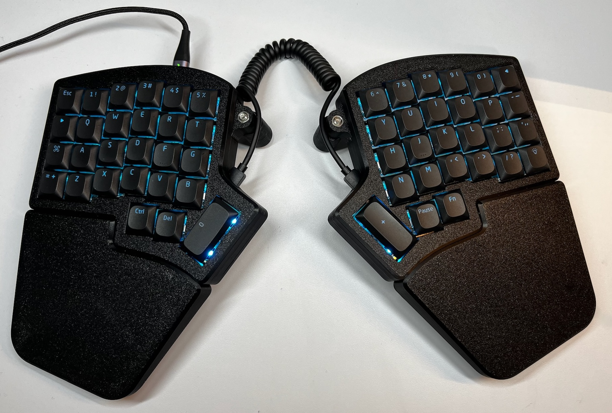
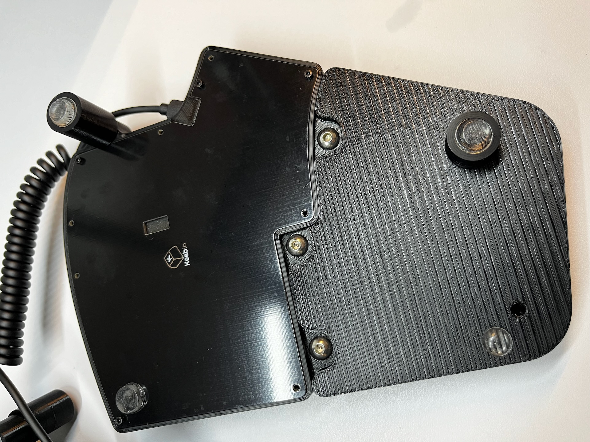

# Iris Case with palm rests and tenting

A case for the [Keebio Iris split ergo keyboard][1] with integrated palm rests and adjustable tenting:

## Remix credits

To design this case I remixed two models:

- [Wrist rests by @MakingSingularities](https://www.printables.com/model/437115-keebio-iris-keyboard-wrist-rests)
- [Official Iris PE case](https://github.com/keebio/iris-case)

The original STLs are included under `original/`.

## Print parameters

I printed all of the parts using PLA on a Prusa MK4 with a 0.4mm nozzle and 15%
infill.

I suggested printed the case and the palm rests top side down and on a textured
surface (it hides imperfections in the first layer and makes them look more
professional IMO).

## Parts

### Case

1. Print [original/Iris PE Top Shell for 1.5mm plate.stl](original/Iris%20PE%20Top%20Shell%20for%201.5mm%20plate.stl)
   twice (once as-is and once mirrored).
2. Print [STLs/mid-layer-left.stl](STLs/mid-layer-left.stl) twice (once as-is
   and once mirrored).
3. Assemble the case using 20x M2x18mm screws

### Palm rests

1. Print [STLs/palm-rest-left.stl](STLs/palm-rest-left.stl) twice (once as-is
   and once mirrored) - printed them with the top side down.
2. Attach to the case using 6x M5x12mm screws (3x on each side).

### Tenting feet

There two feet on each side, a long one at the top and short one at the bottom.

1. Print the following parts:
   - 2x [STLS/foot-extender-18mm.stl](STLS/foot-extender-18mm.stl)
   - 4x [STLS/foot-adapter.stl](STLS/foot-adapter.stl)
   - 4x [STLS/foot-bottom.stl](STLS/foot-bottom.stl)
2. Break the small pin in the foot bottoms and put a small silicon bumpers so the
   keyboard doesn't move around (see photos above).
3. Optional: I puts some GPL205 G00 (switch lube) on the threading as I found
   that it makes a lot easier to connect.
4. Insert an M5 nut into the hexagon hole in each keyboard half's top part (I
   used a vice).
5. Attach the rear foot adapters with an M5x16mm to the nut.
6. Attach the front foot adapter with an M5x12mm directly to the palm rest.
7. Attach one extender to each rear foot adapter.
8. Attach one bottom to every foot.

### Cover

At first I used to carry the keyboard around with me so I printed a cover I can
just put on it so the keys won't get pressed.

It's designed for low-profile keycaps but you can the source code to make it fit
your keycaps - [STLs/cover-right-low-profile.stl](STLs/cover-right-low-profile.stl)

### Screws and nuts

- 20x M2x18mm (for the case)
- 8x M5x12mm (6 for the palm rests, 2 for the inner-front feet)
- 2x M5x16mm (for the inner-rear feet)
- 2x M5 nuts (for the inner-rear feet)

[1]: https://keeb.io/collections/iris-split-ergonomic-keyboard
